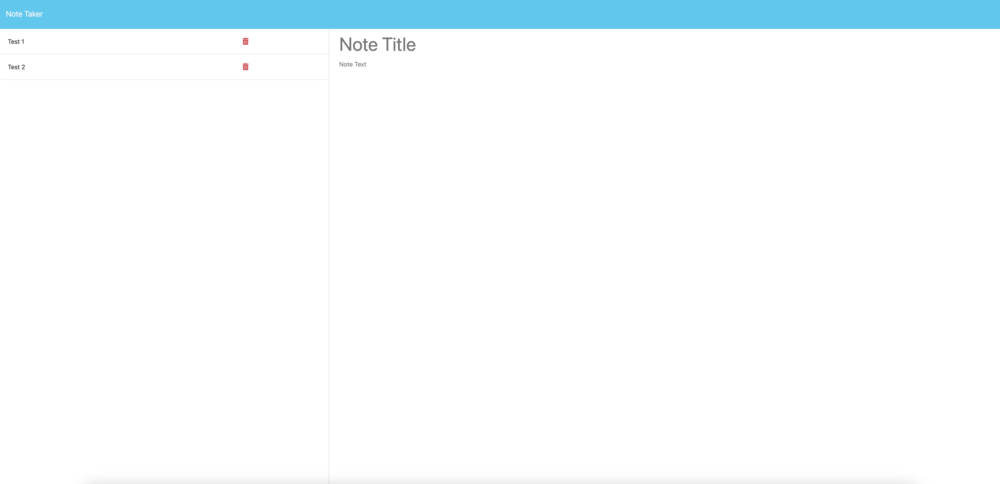

# SVG-Logo-Generator

## Table of Contents
* [Installation](#installation)
* [Description](#description)
* [Usage](#usage)
* [Contributions](#contributions)
* [License](#license)
* [Credits](#credits)
* [Tests](#tests)
* [Questions](#questions)
    
## Installation
To install, please clone this repository to your computer using the following steps:

1. Click the "Code" dropdown menu and copy the SSH URL.
2. Open your terminal and navigate to the directory you would like to clone this repository into.
3. Type "git clone <paste SSH URL>", replacing <paste SSH URL> with your copied SSH URL. You can substitute an SSH URL with an HTTPS URL.
4. Press enter.

## Description
This is an Express-based note taking program that allows a user to generate lists of notes. The user can create new notes, review old notes, and delete unneeded notes.

## Usage
To run the program, navigate into the Note-Taker-Program file and enter "npm start" into your local terminal. Once the program has launched on your local server, navigate to that URL. You will be brought to a home page with a button that says "Get Started."

Click "Get Started," which will bring you to a main page. This page has a section for composing new notes on the right side, and a list of old notes on the left side.

To generate a new note, enter your note title into the "New Title" field and your note text into the "New Text" field. Upon doing so, a "Save Note" and "Clear Form" button will appear in the upper right corner.

Click "Save Note" to save this to your list of notes on the left hand side. Click "Clear Form" to delete the text you input.

To view a previous note, go to the list of notes on the left and simply click on the note you wish to view. To delete a note, click the red trash icon next to the note you wish to delete.

## Contributions
When contributing to this repository, please reach out to me via e-mail to discuss the change you would like to make first. I am open to ideas both with regards to the note composition and the program functionality.

## License
This project is licensed under the MIT License. For more information, please see the [MIT License](https://opensource.org/licenses/MIT).

## Credits
This program was created by Jacob McAuliffe for the UC Berkeley eDX Coding Boot Camp.

## Tests
In the future, I would like to incorporate updates to both the composition of the notes as well as the site functionality. For note composition, adding features such as the ability to change text font, add pictures, or auto-date notes could make for practical next steps. In terms of site functionality, features such as ways of organizing the notes by date or subject, or to be able to download notes in different file types, could make this program even more useful.

## Questions
If you have further questions, you can reach me at [mcauliffemedia@gmail.com](mailto:mcauliffemedia@gmail.com).

GitHub Account: [jacobmca](https://github.com/jacobmca)
